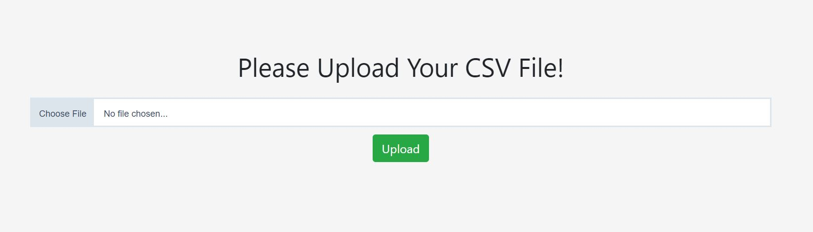

# Product Aggregator
Users can use this application to upload a product file, use filters to query and download an Excel file to show differences between Product Line and Product Generic.
## Tech Stack
Java, Spring Boot, Maven, HTML, CSS, jQuery and Bootstrap.
## How to Run the Application
### Build Image by Yourself
1. Download the Dockerfile and product-aggregator.war to the same folder.
2. At the folder, run "docker build -t myapp:1.1 ."
3. Run "docker run -itd -p 8081:8080 --name="my_application_container" myapp:1.1"
4. Run http://localhost:8081/index to enter the application.
5. You should be able to see the following page.

### Download Image from Dockerhub
1. Run "docker pull ejwang150/product-aggregator:1.1"
2. Run "docker run -itd -p 8081:8080 ejwang150/product-aggregator:1.1"
3. Run http://localhost:8081/index to enter the application.
4. 5. You should be able to see the following page.
